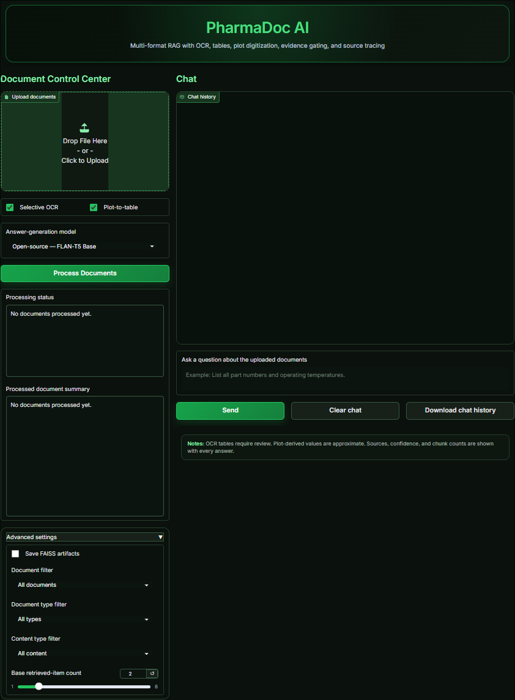
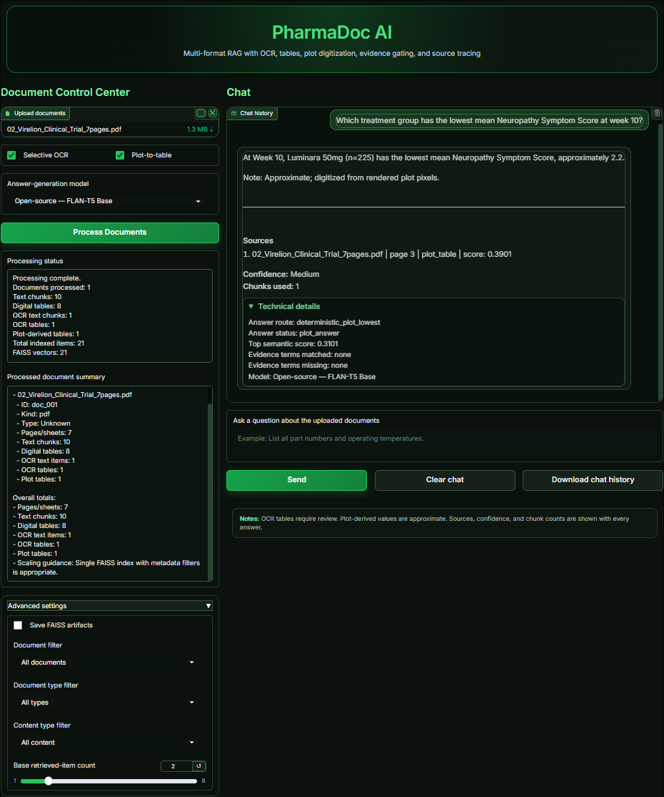

# PharmaDoc AI

<p align="center">
  
  
  
  
  
  
</p>

<p align="center">
  A multi-format Retrieval-Augmented Generation system for pharmaceutical/
  regulatory documents: digital text, structured tables, scanned-page OCR,
  and chart digitization, with deterministic answer routing, evidence
  gating against hallucination, and full source traceability.
</p>

---

> **⚠ Synthetic test data notice**
> The sample documents included in `tests/fixtures/` — the Northbridge BioSystems Single-Use Flow Path Technical Dossier (JPG images) and the Virelion Therapeutics Phase III Clinical Study Summary (PDF) — are **entirely synthetic**. They were generated solely for the purpose of testing this software. They contain no real patient data, no real clinical trial results, and no real company, product, or regulatory information. They must not be used for any regulatory, clinical, or commercial purpose.

---

## Screenshots

<table>
<tr>
<td></td>
<td></td>
</tr>
<tr>
<td align="center"><em>Document Control Center ready for upload</em></td>
<td align="center"><em>Chart question answered deterministically with source tracing</em></td>
</tr>
</table>

---

## Portfolio Summary

This project demonstrates production-style document AI engineering across
the full stack: multi-format ingestion (PDF, DOCX, images, spreadsheets,
CSV), geometric table detection, selective OCR, line-chart digitization,
hybrid FAISS retrieval, deterministic answer routing before any LLM call,
evidence-gated generation with confidence scoring, Gradio deployment,
Docker packaging, and a three-tier pytest validation suite. The domain
is pharmaceutical and regulatory documents, where answer reliability
matters more than coverage.

---

* [Screenshots](#screenshots)
* [Portfolio Summary](#portfolio-summary)
* [Overview](#overview)
* [Features](#features)
* [How It Works](#how-it-works)
* [Answer Routing](#answer-routing)
* [Project Structure](#project-structure)
* [Installation](#installation)
* [Running the App](#running-the-app)
* [Running with Docker](#running-with-docker)
* [Configuration](#configuration)
  * [OpenAI Backend (optional)](#openai-backend-optional)
* [Running Tests](#running-tests)
* [Design Decisions](#design-decisions)
* [Limitations](#limitations)
* [Why PharmaDoc AI is not just another RAG chatbot](#why-pharmadoc-ai-is-not-just-another-rag-chatbot)

---

## Overview

PharmaDoc AI ingests mixed-format pharmaceutical and regulatory documents
(specifications, certificates of analysis, clinical trial reports,
supplier qualification records) and answers questions against them with
full source traceability -- file, page, bounding box, and confidence
for every answer.

It implements the full pipeline:

1. Ingest PDFs, DOCX, images, and spreadsheets.
2. Extract digital text, geometrically detect and classify tables, and
   selectively OCR pages with no extractable text.
3. Digitize line charts into structured `(x, series, y)` data via axis
   calibration and per-series pixel tracing.
4. Deduplicate near-identical content across extraction methods.
5. Build a hybrid (semantic + lexical + metadata) FAISS retrieval index.
6. Route each question through five deterministic answer paths --
   structured single/multi-field, comparison, materials, plot-value
   lookup -- before falling back to evidence-gated LLM generation.
7. Surface sources, confidence, and chunk counts with every answer.

The goal is correctness on documents that don't look like clean prose:
multi-table PDFs, scanned signature pages, and embedded chart images.

---

## Features

| Capability | Detail |
|---|---|
| **Multi-format ingestion** | PDF, DOCX, TXT, CSV, XLSX, PNG/JPG/TIFF/BMP |
| **Geometric table detection** | Column-clustering on word positions, not just PDF table objects; recovers missing headers |
| **Selective OCR** | Tesseract only runs on pages below a digital-text-density threshold, not the whole document |
| **Plot digitization** | Axis-tick calibration + per-series color/position tracing turns a line-chart image into queryable rows |
| **Hybrid retrieval** | FAISS semantic search reranked with lexical overlap, identifier matching, and table/key-value intent detection |
| **Deterministic answer routing** | Structured-field, multi-field, comparison, and materials questions are answered by direct lookup, not generation -- eliminates hallucination risk for the question types where it matters most |
| **Evidence gating** | LLM-generated answers are checked against retrieved evidence terms before being returned |
| **Local-first generation** | FLAN-T5 Base by default; optional OpenAI backend if a key is configured |
| **Full source traceability** | Every answer reports file, page, content type, and a confidence label |
| **Document deduplication** | SHA-256 + normalized-signature dedup across overlapping extraction methods |
| **Persistence** | Save/load a processed FAISS index + content store across sessions |
| **Explicit session state** | `RAGState` threaded through Gradio's `gr.State()` -- no module-level mutable globals |

---

## How It Works

```text
User uploads PDF / DOCX / image files
              |
              v
   Document Registry (ingestion.py)
   SHA-256 dedup, file-kind detection, doc-type tag
              |
   +----------+-----------+------------------+
   |                      |                  |
   v                      v                  v
Digital Text       Geometric Table     Selective OCR +
text_extractor.py  Detection           Plot Digitization
                   tables.py           ingestion.py
   |                      |                  |
   +----------+-----------+------------------+
              |
              v
   Deduplication + Chunking (persistence.py)
   normalized signatures across extraction paths
              |
              v
   Hybrid FAISS Index (retrieval.py)
   semantic + lexical + table/key-value intent
              |
        User asks a question
              |
              v
   Deterministic Answer Router (answer_routing.py)
   structured field / comparison / materials / plot lookup
              |
       no deterministic match
              |
              v
   Evidence-Gated LLM Generation
   (generation.py / evaluation.py)
   FLAN-T5 / OpenAI, checked against retrieved evidence
              |
              v
   Gradio Chat UI (app.py)
   answer + sources + confidence + chunk count
```

---

## Answer Routing

Most RAG systems send every question straight to an LLM. PharmaDoc AI
tries five deterministic routes first -- direct lookups against the
extracted structured data -- and only falls back to generation if none
of them match:

| Route | Handles | Example |
|---|---|---|
| Structured single-field | "What is the lot number of X?" | exact key-value lookup |
| Structured multi-field | "What are the part numbers and operating temperatures?" | multi-column row lookup |
| Comparison | "Compare the operating temperature and material for X" | cross-table join |
| Materials | "Which material is used for the blister tray?" | component-to-material lookup |
| Plot value | "What was the score at week 12 for the 25mg group?" | digitized chart row lookup |
| *(fallback)* LLM generation | open-ended / narrative questions | evidence-gated FLAN-T5 |

Deterministic routes can't hallucinate -- they either find the field in
the extracted data or they don't. This matters most for exactly the
questions (dosages, part numbers, lot numbers, expiration dates) where a
wrong-but-plausible-sounding LLM answer would be the most dangerous.

---

## Project Structure

```text
pharmadoc-ai/
|
+-- pharmadoc/
|   +-- __init__.py
|   +-- config.py              # constants, runtime config
|   +-- metadata.py            # content-item / document-record schemas
|   +-- text_extractor.py      # digital text extraction + chunking
|   +-- tables.py              # geometric table detection + classification
|   +-- retrieval.py           # embeddings, FAISS, hybrid retrieval
|   +-- generation.py          # source formatting, confidence, LLM calls
|   +-- answer_routing.py      # 5 deterministic answer routes
|   +-- ingestion.py           # registry, selective OCR, plot digitization
|   +-- persistence.py         # dedup, save/load FAISS artifacts
|   +-- evaluation.py          # plot routing, master answer dispatcher
|   +-- state.py               # RAGState (explicit Gradio session state)
|   +-- app.py                 # Gradio UI, theme, launch
|
+-- tests/
|   +-- conftest.py
|   +-- fixtures/
|   |   +-- 01_Northbridge_Bioprocess_3pages_page-000[1-3].jpg
|   |   +-- 02_Virelion_Clinical_Trial_7pages.pdf
|   |   +-- 01_Northbridge_Bioprocess_complete_ground_truth.txt
|   |   +-- 02_Virelion_Clinical_Trial_7pages_ground_truth.txt
|   +-- test_unit_extraction.py        # no models/fixtures needed
|   +-- test_pipeline_integration.py   # real fixtures, no models needed
|   +-- test_final_validation.py       # real fixtures + real models (slow)
|
+-- requirements.txt
+-- pytest.ini
+-- Dockerfile
+-- .gitignore
```

---

## Installation

```bash
git clone <this-repo-url>
cd pharmadoc-ai
python -m venv venv
source venv/bin/activate   # Windows: venv\Scripts\Activate.ps1
pip install -r requirements.txt
```

System dependency: `tesseract-ocr` must be installed separately (`apt-get
install tesseract-ocr` on Debian/Ubuntu, `brew install tesseract` on
macOS) -- it isn't a pip package. The Dockerfile handles this for you.

The embedding model (`all-MiniLM-L6-v2`) and FLAN-T5 Base are downloaded
automatically on first run and cached locally afterward.

---

## Running the App

```bash
python -m pharmadoc.app
```

Then, in the Gradio UI: upload one or more documents, click **Process**,
and ask a question. Each answer shows its source file/page, confidence,
and chunk count; technical routing details are available in a collapsed
section under each answer.

---

## Running with Docker

```bash
docker build -t pharmadoc-ai .
docker run -p 7860:7860 pharmadoc-ai
```

---

## Configuration

Key defaults, set in `pharmadoc/config.py`:

| Setting | Default | Description |
|---|---|---|
| `EMBEDDING_MODEL_NAME` | `all-MiniLM-L6-v2` | Sentence-embedding model |
| `LOCAL_LLM_MODEL_NAME` | `google/flan-t5-base` | Local generation model |
| `CHUNK_SIZE` / `CHUNK_OVERLAP` | 1000 / 150 | Text chunking |
| `DEFAULT_TOP_K` | 2 | Chunks retrieved per question |
| `OCR_MIN_DIGITAL_CHARS` | 60 | Below this, a page is sent to OCR |
| `OCR_RENDER_DPI` | 200 | Page render resolution for OCR |
| `PLOT_SAMPLE_POINTS` | 30 | Points sampled per chart series |
| `PHARMADOC_PERSIST_DIR` | `rag_artifacts` | Directory for saved FAISS index and content store (override via env var) |

### OpenAI backend (optional)

The answer-generation model dropdown offers two choices:

- **Open-source — FLAN-T5 Base** (default): runs fully locally, no API key needed, downloaded automatically on first use.
- **OpenAI — GPT-4o mini**: calls the OpenAI API using the `gpt-4o-mini` model. Better for open-ended narrative questions; requires a paid API key.

To enable the OpenAI option, set the `OPENAI_API_KEY` environment variable before launching the app:

**macOS / Linux:**
```bash
export OPENAI_API_KEY="sk-..."
python -m pharmadoc.app
```

**Windows (PowerShell):**
```powershell
$env:OPENAI_API_KEY = "sk-..."
python -m pharmadoc.app
```

**`.env` file (persistent across sessions):**

Create a file named `.env` in the project root (it is already listed in `.gitignore` and will not be committed):
```
OPENAI_API_KEY=sk-...
```
Then load it before running — for example with `python-dotenv`:
```bash
pip install python-dotenv
```
```python
from dotenv import load_dotenv
load_dotenv()
```
Or simply set the variable in your shell profile so it is always available.

If no key is found when OpenAI is selected, the app returns a clear message asking you to add the key rather than raising an error, so selecting OpenAI without a key is safe — it just won't generate an answer.

---

## Running Tests

```bash
# Fast: unit tests + real-PDF pipeline tests, no models needed
pytest tests -v -m "not needs_models"

# Full: also runs the model-dependent end-to-end validation
# (needs internet access to download the embedding + FLAN-T5 models)
pytest tests -v
```

All fixture documents are included in the repository, so the full test
suite runs immediately after cloning with no additional file setup.

### Test fixtures

The `tests/fixtures/` directory contains six files. Their status and purpose differ:

**Document fixtures — included in the repository:**

| File | Used in tests | Purpose |
|---|---|---|
| `01_Northbridge_Bioprocess_3pages_page-0001.jpg` | Yes — `test_pipeline_integration.py`, `test_final_validation.py` | Borderless OCR table; burst pressure result |
| `01_Northbridge_Bioprocess_3pages_page-0002.jpg` | `test_pipeline_integration.py` only | Bordered table; flow coefficient release spec |
| `01_Northbridge_Bioprocess_3pages_page-0003.jpg` | `test_pipeline_integration.py` only | Bordered image-only OCR table; port concentricity |
| `02_Virelion_Clinical_Trial_7pages.pdf` | Yes — both integration and validation | 7-page mixed PDF: tables, narrative, chart, OCR page |

All four document files are synthetic (see the notice at the top of this README) and are committed to the repository so that the full test suite runs immediately after cloning with no manual setup.

**Ground truth files — committed to the repository:**

| File | Used in tests | Purpose |
|---|---|---|
| `01_Northbridge_Bioprocess_complete_ground_truth.txt` | Not directly | Full human-readable ground truth for all 3 Northbridge pages: exact table values, section text, headers, and product metadata. Reference for writing new tests. |
| `02_Virelion_Clinical_Trial_7pages_ground_truth.txt` | Not directly | Full human-readable ground truth for all 7 Virelion pages: tables, narrative, plot data (including the exact week-by-week values for the chart on page 3), and the OCR-only page. Reference for writing new tests. |

The ground truth files document the complete expected content of each fixture document so that anyone reading the repo can understand what the documents contain and write their own tests.

---

## Design Decisions

### Deterministic-first answer routing
See [Answer Routing](#answer-routing) above. Generation is the fallback,
not the default.

### Explicit `RAGState`, not module globals
Gradio session state is threaded explicitly through `gr.State()` rather
than relying on bare module-level globals, which do not survive across
concurrent sessions in a multi-user Gradio deployment.

### Selective OCR, not OCR-everything
Running Tesseract on every page is slow and noisy. Pages with sufficient
extractable digital text skip OCR entirely; only image-only/scanned pages
go through it.

### Deduplication across extraction paths
The same content can surface through digital text extraction, table
detection, and OCR simultaneously on a mixed-format page. Items are
deduplicated by normalized signature before indexing.

---

## Limitations

* Plot digitization is approximate (pixel-position sampling, not embedded
  data recovery) — answers from the plot route are labeled accordingly.
* OCR quality depends on scan resolution; low-quality or heavily compressed
  scans may produce degraded table extraction.
* Some questions may not receive a precise answer due to known extraction
  challenges: OCR can misread row labels in merged or header-style table
  cells, short tokens such as dosage numbers can be filtered out by the
  entity-matching logic, and values that span multiple content types on the
  same page may not resolve cleanly through a single route.
* Single-process, single-session state by default — no multi-user database
  backing `RAGState` between server restarts.
* Local FLAN-T5 Base is a small model; complex multi-hop reasoning questions
  are better served by the optional OpenAI backend.

---

## Why PharmaDoc AI is not just another RAG chatbot

Most RAG demos retrieve text chunks and send them straight to an LLM.
PharmaDoc AI tries to avoid the LLM entirely for high-risk factual questions.

Before any model call, the pipeline attempts five deterministic answer routes:

| Route | What it handles |
|---|---|
| Structured single-field | Lot numbers, burst pressure, Cmax, alpha allocation, expiration dates |
| Structured multi-field | Material specs, operating conditions across multiple fields |
| Comparison | Cross-column or cross-row value comparisons within the same table |
| Materials | Bill-of-materials and polymer/component identification |
| Plot lowest / highest | Minimum or maximum series value from a digitized chart |

If a deterministic route produces an answer, the LLM is never called.
The LLM is used only as a fallback for narrative questions where no
structured match is possible.

This matters for pharmaceutical and regulatory documents where a wrong
value — a dose, a specification limit, a test result — carries real risk.
An LLM that confidently produces "1.18 MPa" instead of "1.24 MPa" is
worse than no answer at all. Deterministic-first routing makes the
system's behaviour predictable and auditable, with every answer citing
its source document, page, content type, and confidence score.
